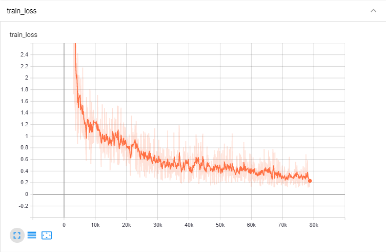
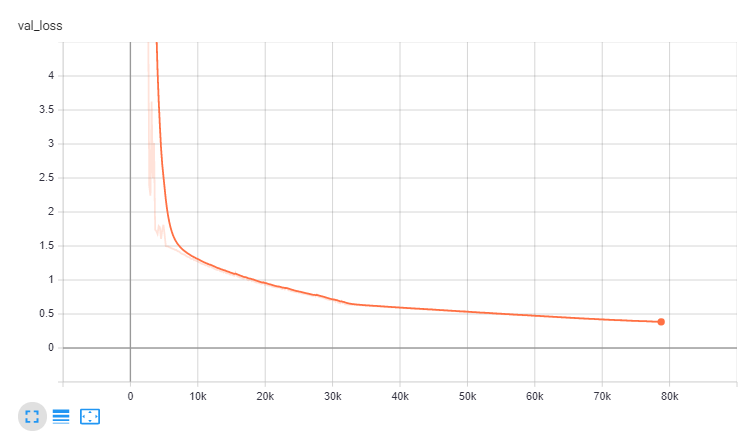
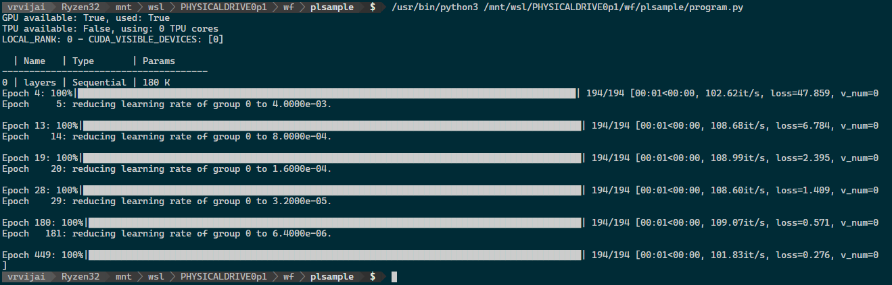

# Regression Sample with PyTorch-Lightning

This repository contains the solution to the problem outlined in [`instructions`](instructions.md), along with the model, training code in pytorch with pytorch-lightning, results and tensorboard logs collected during training.

## Model definition

Model definition and training loop is present in `plnn_module.py` file. The current model may be a bit huge for the problem at hand, but it gives reasonable results, which can be verified by the training and validation loss given in the tensorboard logs. Given more time it might be possible to finetune the model and hyper parameters further using automated methods. The model definition can be easily customized by changing the `hidden_layers` arrray defining the neurons in each hidden layer.

## Results

The model achieved reasonable results for the training and test data that was provided. The **MAE** (L1Loss) for validation was **0.2**, when the training was finished. The result from the inference is saved in a separate column with label 'Y', along with inputs, in the file [`test_pred.csv`](data/test_1/test_pred.csv).

The model checkpoint is saved in `checkpoints` folder and training logs are saved in `logs` folder. It can be inspected using tensorboard.

Training and validation loss during training is given in the following graphs.

Training progress and learning rate change are shown in the logs below.

## Running the program

Run `program.py` after installing pytorch, pytorch-lightning and pandas. Default parameters are included in the program, but can be customized using commandline arguments. It should be possible to replicate the same results as random seed is fixed and deterministic option is turned on for pytorch-lightning.

Basic sanity checks for the data can be done using 'data_analysis.ipynb'.

## Warning!

No error handling is done in the current version.
